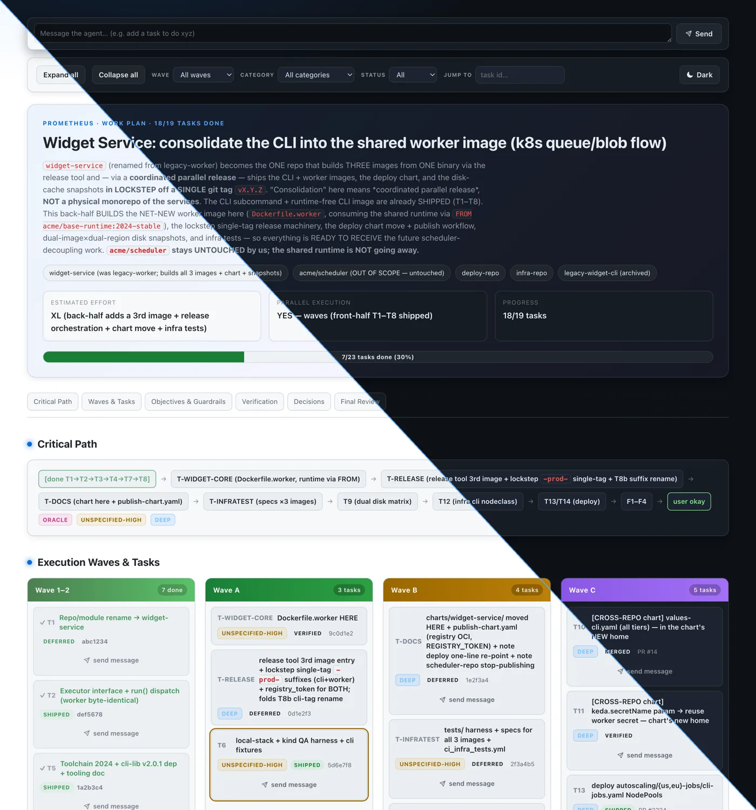
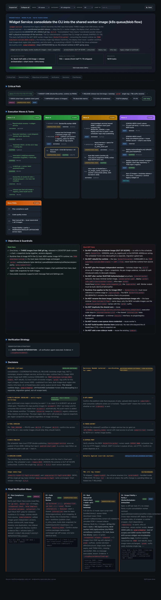
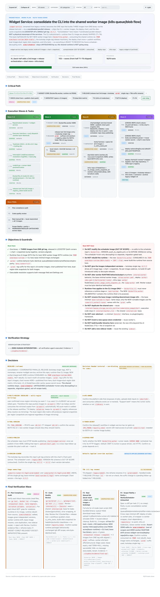

# opencode-plan-canvas

Turn a Prometheus-style work plan (Markdown) into a single, self-contained,
offline HTML canvas styled like GitHub's dark theme. One input file, one output
file, zero network calls at view time.

## What it is

`opencode-plan-canvas` reads a plan Markdown file and emits one `.html` file. The
output is a static canvas: a hero header, a critical-path flow, execution waves
with expandable task cards, objectives and guardrails, a verification section,
decisions, and a final verification wave. Everything (CSS included) is inlined
into the single HTML file, so it opens straight from disk with no server, no
CDN, and no build step.

The generator is deterministic: the same plan produces byte-identical HTML on
every run.

## Screenshots

The canvas below is generated from the bundled synthetic plan
(`test/fixtures/golden-plan.md`) — hero, critical path, execution waves with
category badges, and the reverse "message the agent" prompt bar (shown in watch
mode with `--enable-messaging`). It ships both dark and light themes:



<details>
<summary>Full page — dark theme</summary>



</details>

<details>
<summary>Full page — light theme</summary>



</details>

## Install

### From npm (Node or Bun)

`opencode-plan-canvas` is published to npm and runs on both **Node ≥20.11** and
**Bun**. The published package ships compiled JavaScript (`dist/`), so no build
step is needed to use it.

Run it once, without installing, via `npx`:

```sh
npx opencode-plan-canvas <plan.md>
```

Or install it globally to get an `opencode-plan-canvas` binary on your `PATH`:

```sh
npm i -g opencode-plan-canvas
opencode-plan-canvas <plan.md>
```

Watch / live-reload mode works the same way:

```sh
npx opencode-plan-canvas watch <plan.md>            # serves http://127.0.0.1:4499, live-reloads on edit
npx opencode-plan-canvas watch <plan.md> --port 4500 --no-open --out out.html
```

The package also exposes a small library API for programmatic use:

```js
import { generate } from "opencode-plan-canvas";

const { html, warnings } = generate(planMarkdown);
```

### From source (Bun)

For local development the tool runs straight from TypeScript source under Bun:

```sh
bun install
bun run src/cli.ts <plan.md>
```

Or expose a global `opencode-plan-canvas` binary via Bun's linker:

```sh
bun link
opencode-plan-canvas <plan.md>
```

`package.json` also defines a `generate` script (`bun run src/cli.ts`):

```sh
bun run generate <plan.md>
```

To produce the Node-compatible `dist/` build locally:

```sh
npm run build      # compiles src/ → dist/ (ESM) with a node shebang on the CLI
```

## Usage

Primary command, generate a canvas from a plan:

```sh
bun run src/cli.ts test/fixtures/golden-plan.md -o /tmp/readme-check.html
```

That command exits 0 and writes the HTML to the path you pass with `-o`. Drop
`-o` and the output lands next to the input as `<plan-basename>.canvas.html`:

```sh
bun run src/cli.ts my-plan.md
# writes my-plan.canvas.html in the same directory
```

Flags:

```sh
bun run src/cli.ts --help      # or -h: print usage and exit 0
bun run src/cli.ts --version   # or -v: print version and exit 0
```

Arguments:

- `<plan.md>` (positional): the input plan Markdown file. Required for the
  default command.
- `-o`, `--output <file>`: output HTML path. Default:
  `<plan-basename>.canvas.html` next to the input.
- `--help`, `-h`: print help and exit 0.
- `--version`, `-v`: print the version and exit 0.

Exit codes: `0` on success (including `--help`/`--version`), `1` on a usage
error (missing or nonexistent input file, or a bad `--port`). Warnings go to
stderr; stdout stays empty during file generation, so piping is safe. See
[Watch / live mode](#watch--live-mode-v2) for the `watch` subcommand.

## Plan format

The parser is a small, forgiving Markdown reader. It does not run a full
CommonMark engine. It splits the document on `##` / `###` headings and hands
each recognized section to a dedicated parser. Heading matching is normalized:
the parser strips a trailing parenthetical (`Work Objectives (details)` becomes
`work objectives`), case-folds, and matches on an exact or prefix basis. So
section titles can carry extra decoration and still be recognized.

The single `# ` H1 becomes the plan title. Content before the H1 is warned
about and skipped.

Recognized sections:

- **TL;DR**: blockquote lines of the form `> **Label**: value`. Labels are
  free-form (no fixed vocabulary). Known labels feed the hero: `Quick Summary`,
  `Repos` (split on the middle dot into chips), `Estimated Effort`,
  `Parallel Execution`, `Critical Path`.
- **Work Objectives**: `### Must Have` and `### Must NOT Have` become the two
  guardrail lists (bullet items). Any other `###` subsection is kept as a named
  block and may surface under Verification.
- **Verification Strategy**: free-form lines, rendered as a card list.
- **Execution Strategy** with a `### Parallel Execution Waves` subsection: a
  fenced code block (```` ``` ````) holding an ASCII-tree wave layout. A wave
  header looks like `Wave 1-2 (description):`; entries look like
  `├── T1: [x] Title (note)` or `└── T7: [ ] Title`. A `Critical Path: ...` line
  inside the fence, before any wave header, is captured too. A trailing
  `(depends: 1, 9)` note on an entry is parsed as that task's dependencies and
  shown as a subtle `Needs …` line on the card (ids may be `1`, `T2`, or
  `T-WIDGET-CORE`; a `depends:` note is consumed, so it is not also shown as a
  plain note). The reverse `Blocks …` line is derived automatically — if task 3
  depends on task 1, task 1's card shows `Blocks 3`.
- **Decisions Needed / Defaults Applied**: bold-label entries, either as list
  items (`- **Name (status)**: body`) or paragraphs (`**RESOLVED**: body`). A
  trailing `(status)` parenthetical drives the badge; `RESOLVED`, `OPEN`, and
  anything matching `default` map to their statuses, everything else defaults to
  `open` with a warning.
- **TODOs** (task grammar): the task list. Each task starts with
  `- [x] <id>. Title` or `- [ ] <id>. Title`. Ids are flexible:
  `1`, `T8b`, `T-WIDGET-CORE` all parse. A trailing `<!-- ... -->` HTML comment on
  the task line is the state comment; its text drives the badge (`MERGED`,
  `DEFERRED`, `VERIFIED`/`VERIFICATION-ONLY`, `REVIEW_REQUIRED`,
  `DONE`/`SHIPPED`) and a reference (`#140` becomes `PR #140`, a bare
  7-to-40-char hex becomes a commit sha). When several markers appear,
  `DEFERRED` wins over `DONE`. Any checked task with no explicit marker gets a
  `shipped` badge. Indented `**Field**:` blocks under a task become ordered
  fields, each classified as prose text, a fenced code block, or a checklist.
- **Final Verification Wave** (F-grammar, separate from TODOs): lines of the
  form `- [x] F1. **Title** — \`category\``, optionally followed by an
  `Output:` line and a description. Ids start with `F` (`F1`, `F2`, ...).
  Category is a plain string; the six known categories (`deep`, `ultrabrain`,
  `quick`, `unspecified-high`, `writing`, `oracle`) get themed chips, anything
  else renders as a neutral chip.

Task state comments (the `<!-- ... -->` trailers) are read for badges and refs
only. They are not executed or trusted as markup.

## Escaping policy

The generator escapes everything. Every piece of plan-derived text is
HTML-escaped before any transformation, and there is no path to inject raw HTML
from plan content. The only markup the output contains is what the generator
itself emits, plus a tiny inline-markdown allowlist applied to already-escaped
text: `` `code` ``, `**bold**`, and `[label](url)` links where the URL starts
with `http://`, `https://`, or `#`.

The trade-off: if a plan contains literal HTML like `<owner>` or `<code>`, it
renders as visible escaped text (`&lt;owner&gt;`), not as an element. That is
intentional. Correctness and XSS-safety beat honoring embedded HTML. Plans are
often produced by tools and pasted from many sources, so trusting their raw
angle brackets would be a footgun.

## Lenient parsing

The parser never hard-fails on a plan it can partly understand. It renders what
parses and moves on:

- A section that is absent is simply omitted, and its table-of-contents anchor
  is dropped with it.
- A section that is present but empty stays as an empty shell where that makes
  sense (for example, a `TODOs` section with no valid tasks still yields the
  waves region).
- A malformed line is skipped with a warning rather than aborting the run.
- All diagnostics go to stderr as `warn: <line>: <message>` (or `warn: <message>`
  when there is no line), and are also returned to callers of the `generate`
  API. Generation still exits 0.

Example warning emitted while rendering the bundled golden plan:

```
warn: 217: Decision "D-API-OWNER" has no (status); defaulting to open
```

A hard error (missing input file, unreadable input) exits 1. Everything else is
a warning.

## Interactivity

The static HTML canvas isn't just a flat page. Every generated artifact carries
a small, inlined, read-only interactivity layer as a progressive enhancement. No
network, no CDN, no build. If JavaScript is off, the page still reads fine; the
extras just don't appear.

What you get in the static file:

- A progress bar in the hero showing how many tasks are done.
- Expand-all / collapse-all buttons for the task cards.
- Filters for wave, category, and status (done / pending).
- A "jump to task" box with id autocomplete that opens and highlights the card.

All of this is read-only. Nothing here writes back to the plan or hits the
network. The controls appear only when the page loads in a browser with
scripting; view the file over `file://` and it behaves as a normal document.

## Watch / live mode (v2)

`watch` runs a local live-reload server. It renders the plan, serves it on
`127.0.0.1`, and re-renders whenever you save the file. Your browser reloads on
its own over Server-Sent Events (SSE).

```sh
bun run src/cli.ts watch <plan.md>            # serves http://127.0.0.1:4499, live-reloads on edit
bun run src/cli.ts watch <plan.md> --port 4500 --no-open --out out.html
bun run src/cli.ts watch <plan.md> --enable-actions     # guarded two-way controls (default OFF)
bun run src/cli.ts watch <plan.md> --enable-messaging   # send prompts back to the agent (default OFF)
```

The server prints its URL to stdout and, unless you pass `--no-open`, opens your
browser. Stop it with Ctrl-C; it closes the watcher and frees the port.

Watch flags:

- `--port <n>`: port to bind on `127.0.0.1`. Default `4499`. A bad value
  (non-integer, or outside `0`–`65535`) exits 1.
- `--no-open`: don't launch the browser automatically.
- `--out <file>`: also write the plain static HTML (no SSE client injected) to
  this path on every regen, so you always have a shareable file on disk.
- `--enable-actions`: opt in to the guarded two-way controls. Default **off**.
  See below.
- `--enable-messaging`: opt in to the served-only prompt box that queues messages
  for the opencode plugin to relay to the agent. Default **off**. See below.

How the server behaves:

- `GET /` serves the latest canvas with the tiny SSE client script injected.
  Responses are `no-store`, so you never see a stale cached page.
- `GET /events` is the SSE stream. On each regen it emits `event: reload`, and
  the injected client calls `location.reload()`.
- `POST /refresh` is a localhost-only, no-payload nudge that forces an immediate
  re-read and regen (handy for the optional adapter below). It returns `204`.
- `POST /prompt` exists only under `--enable-messaging`. It accepts a small JSON
  body `{ text, taskId? }`, validates it, and queues it as a file for the plugin
  to deliver (see below). It returns `202` on success, `400` on invalid input.

The watcher is `fs.watch`-based and debounced, and it keeps the last good render
if a save momentarily produces an empty or unparseable file, so a mid-write
buffer never blanks your page. If your platform's `fs.watch` misses an event, a
lightweight stat-based poll picks up the change as a fallback.

### Two-way controls (`--enable-actions`, guarded stretch)

`--enable-actions` is a guarded, default-**off** stretch feature. It is
served-only: the extra controls exist only while the page is served by the watch
server, never in the static `--out` artifact. It stays read-only-safe. There are
exactly two actions and neither mutates the plan or any file:

- **copy task prompt**: copies the task title (plus its "What to do" field, if
  present) to the clipboard, entirely client-side.
- **open ref**: only appears when a task carries a full `http(s)` reference URL.
  It POSTs to `POST /action` (allowlisted to a single `open-ref` type), the
  server re-checks the URL against its resolved allowlist, and opens it in your
  browser. Anything without a full `http(s)` URL is refused.

There is no endpoint that edits the plan. `--enable-actions` cannot write back
to disk.

### Message the agent (`--enable-messaging`, guarded stretch)

`--enable-messaging` is a guarded, default-**off** stretch feature that adds a
reverse channel from the canvas back to the opencode agent. Like
`--enable-actions`, it is served-only: the UI exists only while the page is
served by the watch server, never in the static `--out` artifact. It requires
the [optional opencode plugin adapter](#optional-opencode-plugin-adapter) to
actually reach the agent — without the plugin loaded, messages are queued on
disk but nothing relays them.

What you get in the served page:

- **A prompt bar** at the top of the canvas. Type anything (for example, "add a
  task to do xyz") and send it to the agent. `Cmd`/`Ctrl`+`Enter` also sends.
- **A per-task "send message" button** on each expandable task card. It opens a
  small composer scoped to that task, so the delivered prompt is prefixed with
  the task id for context.

How it flows:

1. The browser POSTs `{ text, taskId? }` to `POST /prompt`.
2. The server validates the text (trimmed, non-empty, ≤ 8000 chars) and writes
   one JSON file per message, atomically, into `<root>/.sisyphus/outbox/`. The
   plan normally lives at `<root>/.sisyphus/plans/<name>.md`, so the outbox is
   the sibling `<root>/.sisyphus/outbox`. Nothing about the plan file is
   modified.
3. The opencode plugin adapter watches that outbox directory. For each message
   it picks the most recently active opencode session and forwards the text as a
   user prompt (via the SDK's `session.promptAsync`), then deletes the file. A
   message is only removed after a successful send, so delivery is at-least-once;
   if no session is available yet, the message stays queued until one is.

The server never edits the plan and never runs the message itself — it only
writes a bounded text file that the plugin relays. Filenames are
server-generated; the optional `taskId` is stored for context only and is never
used as a filesystem path.

A couple of guarantees worth knowing:

- **Layout requirement.** The relay only works when the plan lives under a
  `.sisyphus/` tree (the normal case inside opencode), because the plugin only
  watches `<root>/.sisyphus/outbox`. If you run `watch ./plan.md
  --enable-messaging` on a plan outside a `.sisyphus/` directory, the server
  still accepts and queues messages, but the plugin has nowhere to pick them up,
  so they will not be delivered.
- **Freshness.** The plugin drops messages older than ~10 minutes rather than
  relaying them, so a message you queued in a previous, unrelated session never
  gets injected into a fresh one. Delivery is best-effort: a `202` from
  `POST /prompt` means "queued," not "delivered."

### Optional opencode plugin adapter

`adapter/opencode-plugin/` is an **optional** opencode plugin. You don't need it:
the `fs.watch` watcher already regenerates and live-reloads on its own with zero
opencode dependency. Inside an opencode session, file writes are sometimes
buffered, so the adapter just makes updates snappier by listening for opencode's
`file.watcher.updated` event and, when a plan or `boulder.json` file changes,
sending the `POST /refresh` nudge to the running watch server. Skip it and
everything still works, just at normal `fs.watch` latency. The core never
imports from the adapter. See `adapter/opencode-plugin/README.md` for setup.

## Roadmap

Everything below is genuinely not built yet. The shipped v2 features (watch mode,
SSE live reload, read-only interactivity, the guarded `--enable-actions`
controls) are documented above, not here.

- Richer plan writes: no control today edits the plan on disk. Any future write
  path stays a guarded, opt-in stretch, never on by default.

## Relationship to opencode

The core has zero `omo` / `opencode` dependencies. It is plain Bun + TypeScript
with no runtime packages. `opencode` is the **producer** of the plan Markdown
files this tool reads, not a runtime dependency of the tool. You can generate a
canvas from any plan that follows the format above, regardless of how it was
authored.
